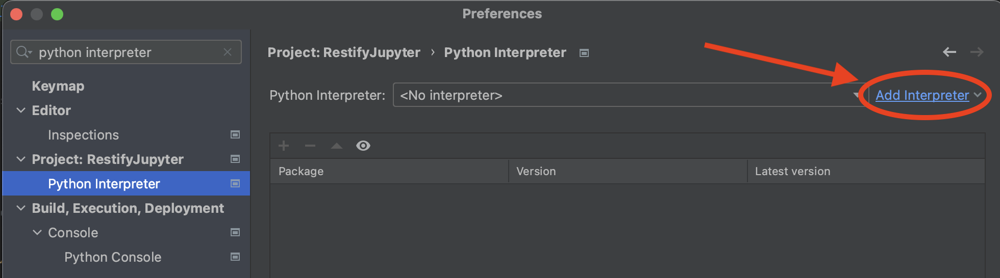

# RESTify Jupyter

Data, Data-Mining and visualization of correlations for the RESTify experiment.


## About

This repository hosts the sources and input data for the RESTify experiment analysis, in form of a Jupyter Notebook
instance.

### Docker Quickstart

The simplest way to replicate all data that we mined in the context of the RESTify Study is to run the interactive Jupyter Notebook in a preconfigured Docker Container.
You will there see a detailed explanation of our methodology, combined with a local integrated replication of our data mining and visualizations.

Steps for replication:

1. [Install Docker](https://docs.docker.com/get-docker/)
2. Clone this repository:  
```git clone https://github.com/m5c/RestifyJupyter.git```
3. Build and Run the Jupyter Notebook Container:  
```cd RestifyJupyter; ./docker-autostart.sh```
4. Access the Notebook, inspect our methodology and replicate our findings.  
With the container running, visit [http://127.0.0.1:8888/notebooks/Restify.ipynb](http://127.0.0.1:8888/notebooks/Restify.ipynb)

## Code inspection for Developers and Data Scientists

In addition to the easily accessible Jupyter Notebook, this project is preconfigured to allow in depth code inspection of all data mining performed, using [PyCharm](https://www.jetbrains.com/pycharm/download/). The free community edition is sufficient and results can also be replicated with any other correctly configured python environment. However the further instructions have been written and tested for PyCharm.

In adition you will need Python 3 installed on your system and set up as standard SDK.  
You can do this directly from the ```PyCharm -> Settings``` menu:  




### Relation to Jupyter

The Data Mining used for the purpose of this project is too complex for Jupyter Notebook cells. The Notebook is still useful to explain the individual and detailed analysis performed and replicate the extracted data on your system. Yet the python cells are merely proxy calls to the actual data analysis performed in this python repository. In the following we also refer to the code cells that showcase in the Jupyter Notebook as *Data Mining Cells*, short DMC.

### Run Configurations

When opened with PyCharm, this project is preconfigured to offer all DMCs as convenient run configurations

Every DMC matches exactly the content and launch configuration of one file in ```jupyter_snippets```:

| DMC | File | PyCharm Launch Config | Output in ```generated-plots```|
|-----|---|---|---|
| 00  | ... | ... | ... |
| 01  | [```display_population_gaussian.py```](restify_mining/skill_extractors/extract_population_gaussian.py) | DisplayPopulationGaussian | ```generated-plots/gaussians.png``` |
| 02  | [```display_control_group_skill_boxplot.py```](restify_mining/skill_extractors/extract_control_group_boxplot.py) | DisplayControlGroupSkillBoxPlot | ```generated-plots/fused-stats.png``` |
| 03  | [```compute_group_skill_diffs.py```](restify_mining/skill_extractors/compute_cgroup_skill_diffs.py) | ComputeGroupSkillDiffs | ```--printed--``` |
| 04  | [```merge_csv.py```](restify_mining/skill_extractors/merge_csv.py) | MergeCsv | ```generated-csv-files/restify.csv``` |
| 05  | [```display_test_results_all_participants_by_method.py```](jupyter_snippets/pseudo_cell_05_all_results_all_participants.py) | DisplayParticipantTestResultsByMethod | ```05-test-individual.png``` |
| 06  | [```display_test_results_all_groups_by_method.py```](jupyter_snippets/pseudo_cell_06_all_tests_all_groups.py) | DisplayGroupTestResultsByMethod | ```06-test-heatmap.png``` |


### Launch Configurations

The repo is preconfigure

## Contents

* The Jupyter files are sprinkled at top level, the main one being: ```restify.ipynb```
    * The snippets listed in the notebook are too complex to be developed in jupyter. They are thus copies of the files
      in ```jupyter_snippets```. Those can be conveniently launched with PyCharm.
    * Additional python files used for the actual mining are in ```restify_mining```.
* Raw input data collected in the experiment is in ```source-csv-files```.
* Plots are stored to ```generated-plots```.

### Raw CSV Data

The contents of ```source-csv-files``` are as follows:

* Task order definition: ```source-csv-files/tasks.csv```
* Unit test statistics CSV: ```source-csv-files/teststats.csv```
* Skill vectors per codename (colours define partition) CSV: ```source-csv-files/patitionskills.csv```
* Post completion ratings CSV: ```TBA```
* Manually extracted time data CSV: ```TBA```

## Usage

For data analysis, use Jupyter. For development of new snippets, use pycharm and place your new snipped in
the ```jupyter_snippets``` directory. Copy the content of your snipped into a new jupyter cell when done.

 * Starting the Notebook: ```jupyter notebook```
 * Visit: [http://localhost:8888/notebooks/Restify.ipynb](http://localhost:8888/notebooks/Restify.ipynb)

### Pycharm Setup

 * Install [PyLint]
 * Configure PyLint to use the root ```.pylintrc``` config file, so it correclty resolves imports.  
(See [this discussion](https://github.com/dense-analysis/ale/issues/208#issuecomment-265590465))
 * Use provided Run configurations to dry run Jupyter cells (working directory preconfigured, so there are no IO issued on CSV import / graph export)

## Author / References

* PI: Maximilian Schiedermeier
* Supervisors: Bettina Kemme, Jörg Kienzle
* Raw Data: ...csv bundle...
* Implementation: Maximilian Schiedermeier
    * Study Instructions, by control group: 
       * [Red](https://www.cs.mcgill.ca/~mschie3/red/restify-study/)
       * [Green](https://www.cs.mcgill.ca/~mschie3/green/restify-study/)
       * [Blue](https://www.cs.mcgill.ca/~mschie3/blue/restify-study/)
       * [Yellow](https://www.cs.mcgill.ca/~mschie3/yellow/restify-study/)
    * Legacy Application Source Code:
       * [BookStore](https://github.com/kartoffelquadrat/BookStoreInternals/tree/RESTifyStudy)
       * [Zoo](https://github.com/kartoffelquadrat/Zoo/tree/RESTifyStudy)
       * [Xox](https://github.com/kartoffelquadrat/XoxInternals/tree/RESTifyStudy)
    * Unit Test Evaluation Script: [RestifyAnalyzer](https://github.com/kartoffelquadrat/RestifyAnalyzer)
* Research Ethics Board Advisor: Lynda McNeil
