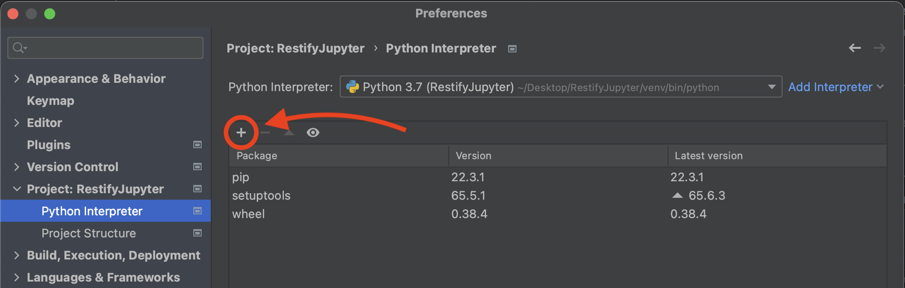
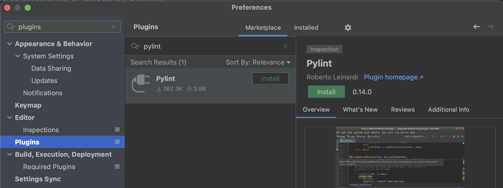

# RESTify Data Analysis

Data, Data-Mining and Visualization for the RESTify experiment.


## About

This repository hosts sources and raw input data that allows replication of empiric findings around the RESTify
experiment.
The data can be reproduced and inspected with a Jupyter Notebook instance, or for more experienced users and
collaborators with a preconfigured PyCharm project.

To replicate our data analysis, you have four options:

* [Inspect the rendered preview on GitHub, using only your browser](Restify.ipynb)  
  => You will **see** all figures of this paper, pre-rendered. However, you will not be able to modify or execute the notebook. Some internal links may not work.
* [Deploy a local Jupyter Notebook as preconfigured Docker container.](#dockerized-notebook)  
  => *The fastest and simplest way to **replicate** our work and findings.*
* [Manually set up a local Jupyter Notebook.](#manual-notebook)  
  => *Similar to the previous option, you can **replicate** the work and findings. The manual setup requires proficiency with python installations.*
* [Manually run individual parts of the data analysis with the PyCharm IDE](#pycharm-ide):  
  => *Full access to all implementation details. The preferred option for peer-reviewers, software developers and data scientists who
  want to investigate and understand our work. You can **replicate** our findings, and on top inspect the implementation. You can debug the code, verify correctness of our implementation, and if desired build on top.*

## Dockerized Notebook

This repository hosts a Docker configuration that creates a container Jupyter Notebook instance with all runtime
dependencies.    
The notebook allows you to locally replicate our methodology and all findings, together with in-depth explanations.

Instructions for Docker (MacOS / Linux host):

1. [Install Docker](https://docs.docker.com/get-docker/)  
   (After install, test your setup with: `docker run hello-world`)
2. Clone this repository:   
   ```git clone https://github.com/m5c/RestifyJupyter.git```
3. Build and Run the Jupyter Notebook Container:  
   ```cd RestifyJupyter; ./docker-autostart.sh```
4. Access the Notebook: [http://127.0.0.1:8889/notebooks/Restify.ipynb](http://127.0.0.1:8889/notebooks/Restify.ipynb)

If you see a notebook with all paper figures and stats, you have succeeded.

## Manual Notebook

This section explains how to run the Jupyter Notebook instance natively. For this to work, you must install all runtime dependencies.

1. Install ```Python 3.9``` or newer. Make sure the installed python interpreter is selected in the PyCharm run
   configurations.
2. Install all required python libraries, e.g. using the ```pip3``` package manager:  
   ```pip3 install pandas numpy matplotlib plotly scipy statsmodels seaborn jupyter```  
   You can also install all at once, with [`pip3 install -r requirements.txt`](requirements.txt)
3. Start up the Notebook:
    * Go to the project base directory: ```cd RestifyJupyter```
    * Start the Notebook: ```jupyter notebook```
    * Access the
      Notebook: [http://localhost:8888/notebooks/Restify.ipynb](http://localhost:8888/notebooks/Restify.ipynb)

## PyCharm IDE

Complementary to the replication of our results with a Jupyter Notebook, you can also directly execute the python code
used for data mining.
This option provides an in depth access to implementation details and is intended for data scientist who want to either:

* Validate the correctness of our extracted data at coding level.
* Enrich our the data analysis we implemented by additional insights.

All runtime dependencies, including python itself, can be directly installed from PyCharm, however it is important that
the IDE is configured to use the correct interpreter.

1. Install PyCharm. The [free *Community Edition*](https://www.jetbrains.com/pycharm/download/) is sufficient.
2. Install the ```python3``` interpreter. You find a corresponding option in the ```PyCharm -> Settings``` menu:  
   
3. Install all required libraries. Open the ```PyCharm -> Settings -> Project -> Interpreter``` menu:
   
    * Click the ```+``` sign, then install everything listed in [`requirements.txt`](requirements.txt)
4. Install PyLint. Open the plugins menu: ```PyCharm -> Settings -> Plugins```:  
   
    * Configure PyLint to use the root ```.pylintrc``` config file, so
      it [correctly resolves imports](https://github.com/dense-analysis/ale/issues/208#issuecomment-265590465).
5. Select the desired run configuration, to replicate any of our results:
    * For every code cell of the Notebook, there is a corresponding preconfigured run configuration.
    * We recommend that you run the ```run_all_pseudo_cell.py``` script, which recreates all statistical figures and
      listings from the paper.

### Inputs and Outputs

* Inputs:  
  The Notebook works on the CSV data, stored in [```source-csv-files```](source-csv-files). It is the same data as
  provided in [our replication bundle](https://anonymous4doubleblinded.github.io/ExperimentReplicationPackage).
* Outputs:
    * Figures are generated to ```generated-plots```
    * Intermediate CSV files are generated to ```generated-csv-files```

## Implementation Details

This section is only relevant for data analysts who want to tweak the notebook output / visualization, or reuse part of the codebase for similar project layouts.

### Label Makers

For scatter plots and scatter series you can easily change how samples are annotated. Just pass a different `LabelMaker`
at the moment of scatter instantiation.  
`LabelMakers` are defined in [`restify_mining/scatter_plotters/extractors`](restify_mining/scatter_plotters/extractors).

If you with to annotated only selected dots, edit the `labeloverride.csv` and use a custom `LabelMaker`.
* To remove all labels, use the `EmptyLabelMaker`.
* To annotate full codenames (colour + animal) use the `FullLabelMaker`.
* To annotate group internal codenames (only animal), use `AnimalLabelMaker`.

## Author / References

* Principal Investigator: [Maximilian Schiedermeier](https://m5c.github.io/)
* Academic Supervisors: [Bettina Kemme](https://www.cs.mcgill.ca/~kemme/)
  , [Jorg Kienzle](https://www.cs.mcgill.ca/~joerg/Home/Jorgs_Home.html)
* Implementation: [Maximilian Schiedermeier](https://github.com/m5c)
    * Study Instructions, by control group:
        * [Red](https://www.cs.mcgill.ca/~mschie3/red/restify-study/)
        * [Green](https://www.cs.mcgill.ca/~mschie3/green/restify-study/)
        * [Blue](https://www.cs.mcgill.ca/~mschie3/blue/restify-study/)
        * [Yellow](https://www.cs.mcgill.ca/~mschie3/yellow/restify-study/)
    * Legacy Application Source Code:
        * [BookStore](https://github.com/m5c/BookStoreInternals/tree/RESTifyStudy)
        * [Zoo](https://github.com/m5c/Zoo/tree/RESTifyStudy)
        * [Xox](https://github.com/m5c/XoxInternals/tree/RESTifyStudy)
    * Participant Submission Analyzer: [RestifyAnalyzer](https://github.com/m5c/RestifyAnalyzer)
* Research Ethics Board Advisor: Lynda McNeil
